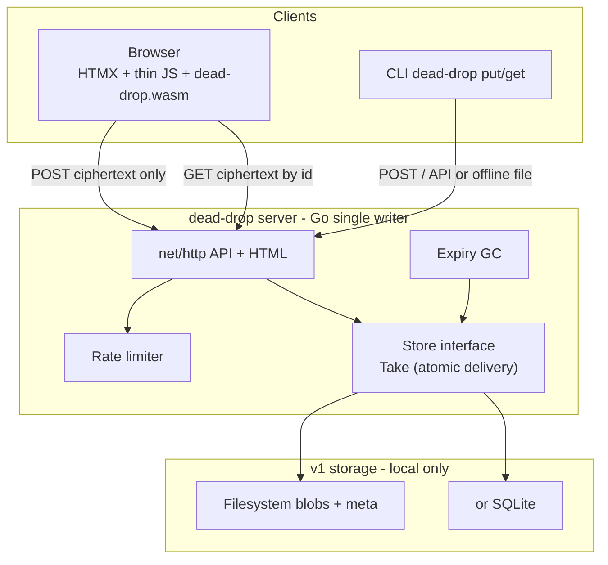
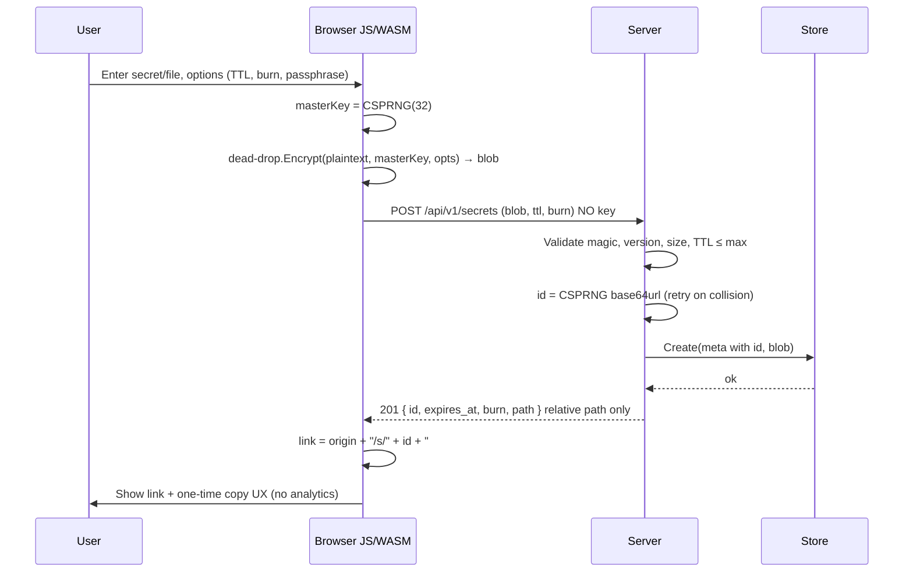
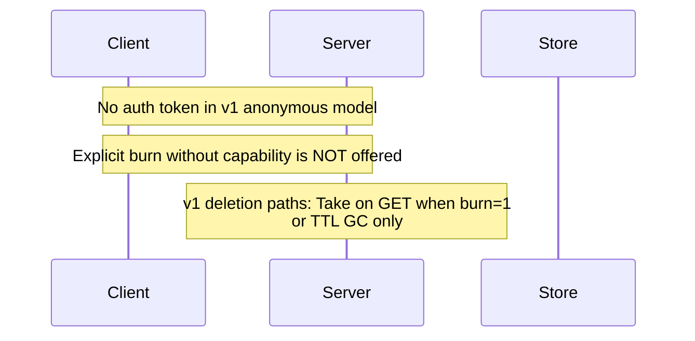
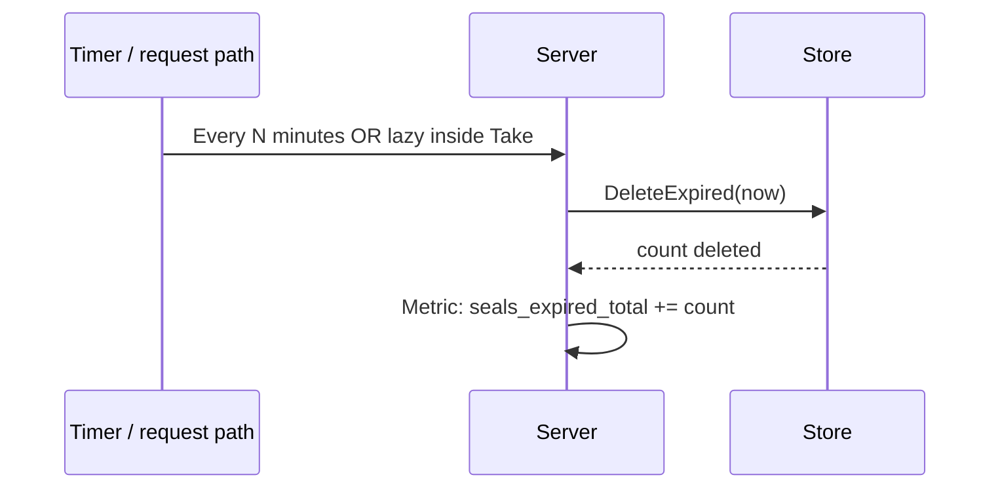
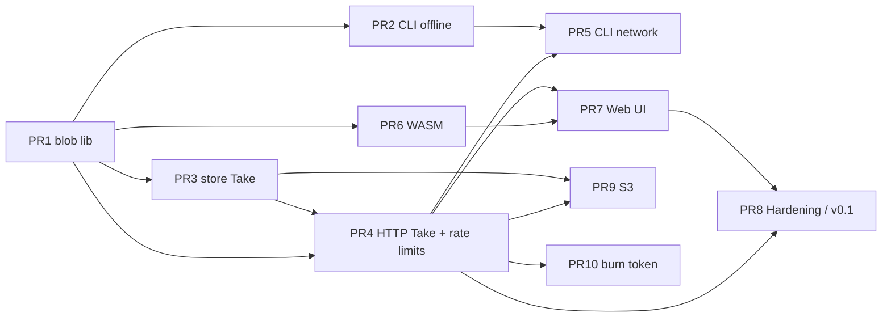

# dead-drop — Client-Side Encrypted Secret & File Sharing

| Field | Value |
|-------|--------|
| **Document** | Design specification (v1) |
| **Codename** | **dead-drop** |
| **Module** | `github.com/donkeyx/dead-drop` |
| **Author** | donkeyx / David (design by Grok Build) |
| **Date** | 2026-08-11 |
| **Status** | Draft (revised after design review) |
| **License (target)** | MIT |
| **Audience** | Senior engineers implementing or reviewing dead-drop |

**Name rationale:** *dead-drop* — spy/ops metaphor for leaving something for someone else to collect (often once). Fits donkeyx tool style (`tcp-wait`, hyphenated, practical). Module `github.com/donkeyx/dead-drop`, binary `dead-drop`. Crypto package format remains **SEAL v1** (sealed blob). Alternates rejected: *sealshare* (too product-y), *zksend* (overclaims ZK proofs).

**Product language (user-facing README and UI):** standardize on **“client-side encrypted”** and **“the operator cannot read plaintext at rest.”** Use **“zero-knowledge storage”** only with that storage qualifier. Avoid bare “ZK” badges or shorthand that imply zk-SNARK-style proofs. Internal design prose may say “ZK-style paste” once defined as above.

---

## Overview

dead-drop is a **self-hostable, MIT-licensed** service for sharing a short secret or small file such that **the host never sees plaintext**. Encryption and decryption run **only on the client** (Go compiled to WASM in the browser, or the same Go library via CLI). The server stores ciphertext, metadata (TTL, burn flag, size, format version), and returns a share id. The **decryption key lives exclusively in the URL fragment** (`#…`), which browsers do not send on HTTP requests. An optional **user passphrase** acts as a second factor when the full link might leak (chat logs, referrer-less copy/paste still leaks the fragment if someone has the full URL).

The stack is deliberately narrow: one language (Go 1.22+) for crypto format, server, WASM, and CLI; **HTMX** for progressive server-driven UI around (not instead of) client crypto; **stdlib `net/http`** for the HTTP surface; **filesystem or SQLite** storage for v1. Defaults favor security: burn-after-read **on**, short TTLs, size caps, rate limits, long random ids.

**v1 deploy shape:** **single writer process / single node** with a local data directory (see [Deployment constraints (v1)](#deployment-constraints-v1)). Horizontal replicas are unsupported until a shared Store with atomic claim exists.

This document is the implementation blueprint for a **greenfield** repo at `/home/david/mywork/repos/dead-drop/` (or equivalent). No code is implemented yet.

---

## Background & Motivation

### Problem

People need to pass API tokens, passwords, private keys, and small config files through channels that retain history (Slack, email, ticket systems). Pasting secrets into those channels creates durable copies. Operators of pastebins and “secure notes” often can read content (server-side encryption with operator-held keys, or plaintext at rest). Users who self-host still want a clear story: **disk theft or DB dump must not yield secrets**.

### Current state (ecosystem)

| Project | Model | Gaps relative to this goal |
|---------|--------|----------------------------|
| PrivateBin | Client JS crypto, fragment key | Separate JS crypto stack; PHP server; not Go-native |
| Firefox Send (retired) | Client crypto, large files | Product dead; different scale/abuse surface |
| age / rage | Excellent file encryption | No hosted share UX, no burn/TTL service |
| password managers “share” | Account-centric | Not anonymous drop; different trust model |
| naive pastebin | Server sees plaintext | Fails the threat model entirely |

### Pain points this project addresses

1. **Operator trust:** “Even I shouldn’t be able to read what users drop” for self-hosters and multi-tenant friends/family instances.
2. **Single-language crypto:** Avoid dual implementations (TS + Go) diverging on AEAD parameters, nonce handling, or passphrase KDF.
3. **Honest defaults:** Burn-after-read and short TTL by default, not buried in advanced settings.
4. **Composable library:** Same blob format for WASM UI, CLI offline encrypt, and future S3-backed multi-node storage.

### Non-marketing honesty

dead-drop does **not** protect against a malicious or compromised **origin that serves the WASM/JS**. Anyone who can alter hosted scripts can exfiltrate keys or plaintext at encrypt/decrypt time. XSS, malicious browser extensions, and full-link leakage remain real. The design documents these limits instead of promising “unbreakable” secrecy.

---

## Goals & Non-Goals

### Goals

1. **Client-side AEAD** before upload; server never accepts or stores plaintext or raw keys.
2. **Fragment-only key transport** in the primary UX (`/s/{id}#{key}`).
3. **Optional passphrase** as second factor, well-specified KDF, no plaintext passphrase on the wire.
4. **Shared Go crypto library** used by server validation (structure only), WASM, and CLI with byte-identical encrypt/decrypt.
5. **HTMX-friendly UI** for create/reveal flows; crypto still runs in WASM/JS on the client.
6. **Self-hostable** single binary + data directory; MIT license; Docker image later.
7. **Secure defaults:** burn-after-read on, TTL 24h (max 7d), rate limits, 128-bit ids, 256-bit keys.
8. **Honest threat model** and CSP/hardening so the browser surface is as tight as practical.
9. **Library-first layout** (`import "github.com/donkeyx/dead-drop/..."`) plus `cmd/dead-drop` for server and CLI subcommands.
10. **Atomic `Take` delivery** so concurrent GETs cannot double-fetch burn-after-read ciphertext (no Get-then-Delete).

### Non-Goals (v1)

1. User accounts, multi-tenant auth, org SSO.
2. Large file / resumable upload (no multi-GB Send clone).
3. End-to-end messaging, chat, or multi-recipient access control lists.
4. Proof-of-work or Tor-only deployment as a hard requirement (optional docs later).
5. Mobile native apps (responsive web + CLI is enough).
6. Server-side search, preview of ciphertext content, or admin “break glass” decrypt.
7. Cryptographic deniability / steganography.
8. Guarantees against a hostile page origin or supply-chain compromise of the served WASM.
9. Federated multi-server protocol (ActivityPub etc.).
10. **Multi-replica / horizontally scaled app servers** against local SQLite or local FS (see deployment constraints).
11. **CORS / cross-origin browser API** access (same-origin UI + CLI only).
12. Cryptographic zero-knowledge *proofs* (SNARKs etc.) — product is client-side encryption with operator-blind storage.

---

## Proposed Design

### High-level architecture



**Trust boundary:** Everything left of the TLS terminator that holds **plaintext or `#key`** is the client. The server to the right of that boundary holds only ciphertext and non-secret metadata.

### Component layout (repo)

```
dead-drop/
  go.mod                          # module github.com/donkeyx/dead-drop
  LICENSE                         # MIT
  README.md
  blob/                           # versioned ciphertext format + encrypt/decrypt
  crypto/                         # thin wrappers: AEAD, Argon2id, HKDF, RNG
  store/                          # Store interface + fs + sqlite implementations
  server/                         # HTTP handlers, middleware, HTML templates
  web/                            # static: wasm, wasm_exec.js, CSS, minimal JS glue
  cmd/dead-drop/
    main.go                       # subcommands: serve, put, get, version
  internal/
    ratelimit/
    config/
  docs/
    design.md                     # this document (or link)
  Makefile
```

### URL format

| Piece | Format | Notes |
|-------|--------|--------|
| Create UI | `https://host/` | Form: secret textarea or file, options |
| Share link | `https://host/s/{id}#{key}` | **Primary** |
| Reveal page | `GET /s/{id}` — fragment stays local | Server never receives `{key}` |
| Passphrase | Same URL; UI prompts for passphrase | Passphrase never in query/fragment |

**`{id}`:** 128-bit cryptographically random value, **base64url** without padding (22 chars). Example: `s/3H8kQ2n…`.

**`{key}`:** 256-bit cryptographically random **master key material**, base64url without padding (43 chars). This is the fragment payload.

**Canonical link construction (client only):**

```text
`${origin}/s/${id}#${base64url(masterKey)}`
```

- Browser create path: `origin = window.location.origin`.
- CLI `put --server`: build link as `{--server origin}/s/{id}#{key}` using the **user-supplied server base URL**, never from `X-Forwarded-*` or other server-side absolute URL fields.
- API responses return **relative** `path` only (`/s/{id}`). Server **never** returns the fragment, the key, or an absolute URL that includes a key.

**Forbidden URL shapes:**

- Key in query string (`?key=`) — will appear in access logs, `Referer`, browser history sync more broadly.
- Key in path.
- Key in cookies or `localStorage` / `sessionStorage` by default.

**Fragment hygiene (best-effort UX, not a security boundary):**

- Reveal page JS reads `location.hash`, strips leading `#`, decodes key into a session-only JS variable, then calls `history.replaceState` to clear the hash from the visible address bar (**default on**).
- **Clearing is best-effort:** the full link (including fragment) may still exist in browser history, session restore, chat apps, email, screenshots, or shoulder-surfing *before* clear. Clearing does **not** revoke access for anyone who already has the link; use short TTL, burn-after-read, and optional passphrase for that.
- Refresh after clear requires re-paste of the full link (documented in UI).
- Optional “keep key in URL” checkbox for power users (**default off**).

---

### Blob / ciphertext format (normative for v1)

Self-describing binary package. Server treats the body as **opaque** after basic size/magic/version checks; it does not parse crypto fields for decryption.

**v1 uses fixed length-prefixed fields only. No CBOR. No alternate encodings.**

#### On-wire byte layout (version `0x01`)

```text
Offset  Size     Field
------  -------  -------------------------------------------------
0       4        Magic: ASCII "SEAL"
4       1        Version: 0x01
5       1        Flags (bitfield)
6       2        Header length N (uint16 big-endian)
8       N        Clear header (KDF material only; see below)
8+N     24       Nonce (XChaCha20-Poly1305)
8+N+24  rest     Ciphertext || 16-byte Poly1305 tag  (AEAD output)
```

Minimum package size (no passphrase, empty header N=0): `4+1+1+2+0+24+16 = 48` bytes plus encrypted envelope ciphertext.

#### Flags (v1)

| Bit | Name | Meaning |
|-----|------|---------|
| 0 | `HAS_PASSPHRASE` (value `0x01`) | Clear header carries Argon2id salt + params; both fragment master key and passphrase required to open |
| 1–7 | **reserved** | **Must be 0** |

There is **no `IS_FILE` flag**. File vs paste is inferred **after decrypt** from the encrypted envelope (`name` empty ⇒ treat as paste/secret text; non-empty ⇒ file download UX). This avoids leaking classification metadata to the operator (aligned with filename/MIME confidentiality).

**Open (decrypt) rules for flags and header length (v1 strict):** for `Version == 0x01`:

| Condition | Open result |
|-----------|-------------|
| `(flags &^ 0x01) != 0` (any reserved bit set) | **Reject** |
| `flags == 0x00` and `N != 0` | **Reject** (no passphrase ⇒ empty clear header) |
| `flags == 0x01` and `N != 26` | **Reject** |
| `flags == 0x01` and `salt_len != 16` | **Reject** |

**`Seal` MUST only emit** flags in `{0x00, 0x01}` and the matching `N` (0 or 26). New behavior requires a **version bump** or an allocated flag bit with defined semantics in a later format version.

#### Clear header (not secret; AAD-bound)

The clear header holds **only KDF material**. It does **not** contain filename, content-type, or payload hints.

**When `HAS_PASSPHRASE` is clear (`flags == 0x00`):**

```text
N = 0
(clear header is empty)
```

**When `HAS_PASSPHRASE` is set (`flags == 0x01`):**

```text
salt_len      u8       # MUST be 16 in v1
salt          16       # CSPRNG
argon2_time   u32 BE   # e.g. 2 for interactive-wasm
argon2_mem    u32 BE   # KiB, e.g. 32768 (32 MiB) for interactive-wasm
argon2_para   u8       # e.g. 1 for interactive-wasm
# total N = 1+16+4+4+1 = 26
```

`Seal` with passphrase MUST set `salt_len = 16` and `N = 26`. `Open` MUST reject `HAS_PASSPHRASE` with `N != 26` or `salt_len != 16`, or absurd Argon2 params (see limits below).

#### Encrypted plaintext envelope (inside AEAD)

Filename and content-type live **only** here:

```text
Plaintext :=
  meta_len    u16 BE
  meta        meta_len bytes of UTF-8 JSON (no newline requirement)
  raw_payload bytes   # the secret or file bytes (remainder of plaintext)
```

JSON schema (v1):

```json
{"v":1,"ct":"text/plain; charset=utf-8","name":""}
```

| Field | Required | Meaning |
|-------|----------|---------|
| `v` | yes | Envelope schema version; v1 = `1` |
| `ct` | yes | MIME type; default `application/octet-stream` if unknown |
| `name` | yes | Basename only (no path separators); empty string for paste secrets |

**Deterministic Seal encoding (normative for golden `blob_b64url`):**

- Meta is **compact JSON** (no insignificant whitespace, no trailing newline).
- Object keys appear in fixed order: **`v`**, then **`ct`**, then **`name`** (only these three keys).
- Implement with a Go **struct** + `encoding/json.Marshal` (field order = struct field order), **not** `map[string]any` (map key iteration is non-deterministic).
- Numeric `v` is JSON number `1` (not string).
- Positive golden vectors pin **exact Seal output** under this rule.

**Open is liberal:** accept any valid JSON object that provides `v`, `ct`, and `name` (unknown extra keys MAY be ignored; key order and whitespace MUST NOT affect decrypt success). Round-trip tests may re-Seal and compare only if using the normative encoder.

`meta_len` MUST be ≤ 1024. `name` MUST be ≤ 255 UTF-8 bytes and MUST NOT contain `/`, `\`, or NUL. Reject on open if violated.

#### AAD (normative)

```text
aad = magic || version || flags || N_be16 || clear_header
    = first (8 + N) bytes of the package
```

Exactly the prefix through the end of the clear header, **including** the uint16 `N` field. Tampering with magic, version, flags, `N`, or any clear-header byte must cause AEAD open failure.

Tests: flip each framing field independently → `Open` fails.

#### Algorithms (v1 — locked)

| Role | Algorithm | Parameters |
|------|-----------|------------|
| AEAD | **XChaCha20-Poly1305** | Key 32 bytes, nonce 24 bytes random per seal; `golang.org/x/crypto/chacha20poly1305` |
| Master key | CSPRNG | 32 bytes (`crypto/rand`) |
| Passphrase KDF | **Argon2id** | `golang.org/x/crypto/argon2.IDKey` (RFC 9106 / version `0x13` as implemented by x/crypto) |
| Key mix | **HKDF-SHA256** | `golang.org/x/crypto/hkdf` — **always** used for domain separation |

**Why XChaCha20-Poly1305 over AES-256-GCM:**

- 192-bit random nonces → safe random nonces without a central counter (client-side seal, no server coordination).
- Pure Go via `x/crypto`; no cgo; WASM-friendly.
- Same family as libsodium `crypto_aead_xchacha20poly1305_ietf`.

#### Key schedule (normative pseudocode ↔ Go APIs)

Domain separation string (sole v1 AEAD info label):

```text
info = []byte("deaddrop-v1/aead")
```

If a future key type is needed (e.g. separate MAC key), use a new info string such as `"deaddrop-v1/…"` and/or a format version bump — never overload this label silently.

```go
// Normative key schedule (implement byte-identical to this).

masterKey := make([]byte, 32) // crypto/rand; lives in URL fragment only

var aeadKey []byte
if hasPassphrase {
    salt := make([]byte, 16) // crypto/rand; stored in clear header
    // argon2.IDKey(password, salt, time, memoryKiB, threads, keyLen)
    // time/memory/threads are those stored in the clear header (uint32 BE / u8).
    passKey := argon2.IDKey(passphrase, salt, time, memoryKiB, threads, 32)

    // HKDF-Extract then Expand (hkdf.New = Extract-then-Expand).
    // salt for HKDF = passKey (32 bytes); ikm = masterKey.
    r := hkdf.New(sha256.New, masterKey /* ikm */, passKey /* salt */, info)
    aeadKey = make([]byte, 32)
    if _, err := io.ReadFull(r, aeadKey); err != nil { /* fail */ }
} else {
    // ALWAYS HKDF for domain separation even without passphrase.
    // HKDF salt = 32 zero bytes (not "no extract").
    zeroSalt := make([]byte, 32)
    r := hkdf.New(sha256.New, masterKey /* ikm */, zeroSalt /* salt */, info)
    aeadKey = make([]byte, 32)
    if _, err := io.ReadFull(r, aeadKey); err != nil { /* fail */ }
}

nonce := make([]byte, chacha20poly1305.NonceSizeX) // 24; crypto/rand
aead, err := chacha20poly1305.NewX(aeadKey)
ct := aead.Seal(nil, nonce, plaintextEnvelope, aad) // aad = first 8+N bytes
```

Both **masterKey (fragment)** and **passphrase** are required when `HAS_PASSPHRASE` is set. Knowing only the link or only the passphrase is insufficient.

Zero `aeadKey` / intermediate buffers after use where practical; see library API notes on passphrase `[]byte`.

#### Argon2id parameter profiles

Parameters are **stored in the blob header** so decryptors do not guess. Changing *defaults* later does not break old blobs.

| Profile | time | memory (KiB) | parallelism | Use |
|---------|------|--------------|-------------|-----|
| `interactive-wasm` (**browser default**) | **2** | **32768 (32 MiB)** | **1** | WASM/UI encrypt when passphrase set |
| `cli-strong` | 3 | 65536–262144 (64–256 MiB) | 4 | CLI when user opts in (`--strong`) |

**Library reject limits on Open/Seal:** `argon2_mem > 1048576` (1 GiB KiB units) → reject; `argon2_time > 10` → reject; `argon2_para == 0` or `> 16` → reject; `salt_len != 16` when passphrase → reject.

**Runtime memory (separate from .wasm download size):**

| Concern | Budget / note |
|---------|----------------|
| `.wasm` download (gzip) | ≤ 1.5 MiB target (see WASM section) |
| Peak RAM passphrase path (mobile) | **Target ≤ ~48 MiB** process-ish headroom: Argon2 **32 MiB** + ciphertext ≤ 16 MiB + Go WASM runtime + JS copies — tight on low-end devices |
| Risk | First device matrix may force lowering default mem further (e.g. 19 MiB); **header-stored params mean format does not break** |

UI SHOULD warn or lower max upload when passphrase is enabled on narrow viewports / coarse memory hints if available. CLI documents that `cli-strong` is for desktop/server.

Defaults may be adjusted before `v0.1.0` based on a small device matrix; freeze only after that (params still self-describing per blob).

#### What the server NEVER accepts

- Plaintext body fields for the secret.
- Fragment keys, raw AEAD keys, or passphrases.
- **Client-supplied ids** — server always generates id (see id assignment).
- TTL above configured max / below min.
- Updates/PATCH of ciphertext (immutable blobs).
- Cross-origin credentialed browser API use (no CORS — see API).

---

### Sequence diagrams

#### Create secret (browser)



#### Open secret (recipient) — atomic `Take` delivery

HTTP GET **never** branches on `burn_after_read` after a plain read. The handler does not know the flag until the row is loaded; a `Get`-then-`if burn { Delete }` composition is **forbidden** (TOCTOU: concurrent callers both obtain ciphertext).

**Normative delivery path:** the handler calls **exactly one** store method: **`Take`**.

```mermaid
sequenceDiagram
  participant U as Recipient
  participant B as Browser JS/WASM
  participant S as Server
  participant St as Store

  U->>B: Open https://host/s/{id}#{key}
  B->>B: Parse id from path; key from location.hash
  B->>B: Best-effort clear hash from address bar
  B->>S: GET /api/v1/secrets/{id}
  S->>St: Take(id)
  Note over St: Single atomic op: load row;<br/>if expired → delete + not found;<br/>if burn → delete row then return;<br/>if multi-read → return without delete
  alt missing / expired / already taken (burn)
    St-->>S: ErrNotFound
    S-->>B: 404 generic
    B->>U: "Not found or already burned"
  else delivered
    St-->>S: Record (blob + meta including burn flag)
    Note over S: If burn, durable store already empty
    S-->>B: 200 ciphertext + meta headers
    B->>U: If HAS_PASSPHRASE, prompt (never sent to server)
    B->>B: Decrypt(blob, masterKey, passphrase?)
    alt auth failure
      B->>U: "Wrong key or passphrase"
    else ok
      B->>U: Show secret / download file
    end
  end
```

#### Burn-after-read / delivery policy (normative)

##### Single method: `Take` (required for HTTP GET)

```go
// Take delivers a secret for HTTP GET inside one atomic store operation:
//   - load row by id
//   - if missing → ErrNotFound
//   - if expired → delete row (if still present) → ErrNotFound
//   - if BurnAfterRead → delete row from durable store, then return Record
//   - else (multi-read) → return Record without deleting
// Concurrent Take on the same burn=1 id: exactly one returns Record; others ErrNotFound.
Take(ctx context.Context, id string) (Record, error)
```

| Rule | Requirement |
|------|-------------|
| HTTP `GET /api/v1/secrets/{id}` | Calls **`Take` only** — never `Get` then delete/claim |
| Learning `burn_after_read` | Happens **inside** `Take` while holding the store’s atomic section; not a separate prior `Get` |
| Plain `Get` | **Not used on the download path.** Optional for ops/debug/tests only; if implemented, MUST NOT be called from the v1 GET handler |
| Forbidden composition | `rec, _ := Get(id); if rec.Burn { Delete(id) }` — **spec violation** |

##### Backend algorithms (inside `Take`)

| Backend | Atomic `Take` |
|---------|----------------|
| **SQLite** | `BEGIN IMMEDIATE;` load row `WHERE id=?`; if missing/expired → delete if needed, `ROLLBACK`/`COMMIT` + `ErrNotFound`; if `burn=1` → `DELETE WHERE id=?` then `COMMIT` and return in-memory copy; if `burn=0` → `COMMIT` and return without delete. Prefer single-statement patterns where available (`DELETE … WHERE id=? AND burn=1 AND expires_at>? RETURNING *` for the burn branch, else `SELECT … WHERE id=? AND burn=0 AND expires_at>?` for multi-read) **as long as both branches share one transaction / locking so concurrent Takes cannot both observe a burn row**. |
| **Filesystem** | See quarantine lifecycle below. Under data-dir or per-id lock: if burn → rename live → quarantine, read into memory, unlink quarantine, return; if multi-read → read live in place (no rename). Concurrent burn Takes: only one rename wins; loser → `ErrNotFound`. |

**Equivalent two-step filter form** (only if not using a unified `Take` name — same atomicity requirements):

```text
1. Burn path:  DELETE … WHERE id=? AND burn=1 AND expires_at>?  RETURNING *   → if row, deliver
2. Else multi: SELECT … WHERE id=? AND burn=0 AND expires_at>?               → if row, deliver
3. Else:       404
```

Never: unrestricted `SELECT WHERE id=?` on the download path followed by a conditional delete.

**Crash / partial HTTP preference (v1):**

1. **`Take` completes** (burn rows already removed from durable live storage).  
2. **Then** write the HTTP response body from the in-memory `Record`.

If the client disconnects, proxy times out, or `Write` fails after `Take`:

- For burn rows, ciphertext is **gone** (same class as “wrong passphrase still burns”).
- Prefer **“burned but client never got bytes”** over **“two clients got bytes.”**

Document in UI (Appendix A): first successful **Take** of a burn-after-read drop consumes it — including network failure after Take and mistyped passphrase after download.

**Concurrency tests (PR3 + PR4 acceptance):**

- N parallel GETs / `Take`s for the same burn=1 id → **exactly one** success, **N−1** not-found.
- Code review / package checklist: GET handler calls `Take` only (not Get-then-Delete).

**Rejected alternative:** burn only after client confirms decrypt (client can skip confirm and multi-fetch).

#### Filesystem quarantine lifecycle (normative)

```text
$data_dir/
  blobs/…          # live ciphertext
  meta/…           # live meta
  quarantine/      # in-flight burn Takes only
  .lock
```

| Step | Behavior |
|------|----------|
| Burn `Take` | Under lock: `rename` live blob+meta → `quarantine/{id}.*` (unique name). Concurrent rename loss → `ErrNotFound`. |
| Read | Read quarantine files fully into memory. |
| After read attempt | **Always `unlink` quarantine files** for that id (success or I/O error after rename). Live path is already empty. |
| Multi-read `Take` | Do **not** use quarantine; read live files in place. |
| Process crash after rename, before unlink | Live id is gone (burn semantics preserved). Orphan remains under `quarantine/`. |
| **Startup** | Delete all leftover `quarantine/*` — **do not restore** to live ids (would re-enable a second Take of a burned secret). |
| Metrics | Optional `deaddrop_quarantine_reaped_total` on startup reap |

#### Burn (explicit)



**v1 decision:** No public `DELETE /api/v1/secrets/{id}` without a capability. Unauthenticated delete-by-id enables vandalism if ids are leaked without keys. Optional later: **burn token** (separate random 128-bit) at create time (PR10).

#### Expiry GC



**v1:** Lazy expiry inside `Take` (expired → delete + not found) **plus** periodic background sweep (1–5 min).

---

### Server API

Base: JSON/error API under `/api/v1`, HTML under `/` and `/s/{id}`.

#### CORS (v1)

**No CORS headers.** Same-origin browser UI and non-browser CLI only. Do not send `Access-Control-Allow-Origin`. Cross-origin browser apps are a non-goal; adding `*` later would enable browser-based abuse.

#### Error body contract (all `/api/v1/*`)

```json
{"error":"<code>","message":"human readable"}
```

Stable `error` codes:

| Code | HTTP | Meaning |
|------|------|---------|
| `too_large` | 413 | Body exceeds max |
| `bad_blob` | 400 | Magic/version/size framing invalid |
| `bad_ttl` | 400 | TTL out of range / unparseable |
| `rate_limit` | 429 | Rate limited |
| `not_found` | 404 | Unknown, expired, or burned |
| `storage_full` | 503 | Quota / disk watermark |
| `bad_request` | 400 | Other client error |

`429` responses MUST include **`Retry-After`** (seconds).

#### `POST /api/v1/secrets`

**Accepted encodings (v1 freeze):**

**A — preferred (WASM):** `Content-Type: application/octet-stream`

```http
POST /api/v1/secrets HTTP/1.1
Content-Type: application/octet-stream
Content-Length: …
X-Seal-TTL: 24h
X-Seal-Burn: 1

<raw SEAL blob>
```

**B — debugging / simple clients:** `Content-Type: application/json`

```json
{
  "blob": "<base64url ciphertext package>",
  "ttl_seconds": 86400,
  "burn_after_read": true
}
```

**TTL grammar:**

| Source | Grammar |
|--------|---------|
| Header `X-Seal-TTL` | Go `time.ParseDuration` syntax only (`24h`, `90m`, `168h`). **Not** bare integers. |
| JSON `ttl_seconds` | Non-negative integer **seconds** only. |

Omit TTL → server default (`24h`). Burn: header `X-Seal-Burn: 1|0` or JSON `burn_after_read`; default **true** if omitted.

**Id assignment (server):**

1. Generate 16 random bytes via `crypto/rand`, encode base64url (no padding) → `id`.  
2. Set `meta.ID = id` (clients never supply id in v1).  
3. `Create`; on unique-constraint / exists collision, retry up to **N=5** times; if still failing, `500` with generic error (astronomically rare).

**Response `201`:**

```json
{
  "id": "3H8kQ2n…",
  "expires_at": "2026-08-12T15:04:05Z",
  "burn_after_read": true,
  "size": 4096,
  "path": "/s/3H8kQ2n…"
}
```

Relative `path` only. Client concatenates fragment locally.

#### `GET /api/v1/secrets/{id}`

**Default:** raw blob, `Content-Type: application/octet-stream`.

**Optional JSON:** same path with query **`?alt=json`** →

```json
{
  "blob": "<base64url>",
  "burn_after_read": true,
  "expires_at": "…",
  "size": 4096
}
```

No content negotiation via `Accept` required in v1 (query flag only).

**Meta headers (both modes):**

```http
X-Seal-Burn-After-Read: true
X-Seal-Expires-At: 2026-08-12T15:04:05Z
Cache-Control: no-store
Pragma: no-cache
```

**404** for unknown, expired, or already burned — same error body shape (`not_found`).

**Side effect / delivery:** Handler calls **`Take(id)` only**, then writes body from the returned `Record` (see burn/delivery policy). Never `Get` then conditional delete.

#### `GET /s/{id}`

HTML shell for reveal: loads WASM, minimal JS reads fragment, fetches ciphertext, decrypts, renders. **No server-side decrypt.**

#### `GET /healthz` / `GET /readyz`

Liveness/readiness; ready checks storage writable. Optional: data-dir lock held.

#### Explicitly out of API surface

| Endpoint / body | Status |
|-----------------|--------|
| Upload plaintext | **Rejected** — not implemented |
| Submit fragment key | **Rejected** |
| Admin decrypt | **Rejected** |
| List all secrets | **Rejected** |
| Search | **Rejected** |
| CORS preflight success for other origins | **Rejected** (no CORS) |

---

### Storage interface

```go
// store/store.go
package store

import (
  "context"
  "time"
)

type Meta struct {
  ID            string    // always set by server before Create
  CreatedAt     time.Time
  ExpiresAt     time.Time
  BurnAfterRead bool
  Size          int64
  FormatVersion uint8
  // Optional: remote IP hash for abuse forensics — see privacy section
}

type Record struct {
  Meta Meta
  Blob []byte // opaque SEAL package
}

var ErrNotFound = errors.New("store: not found")

type Store interface {
  // Create inserts a new record. meta.ID must already be set by the server.
  // Returns an error that the server maps to collision retry if id exists.
  Create(ctx context.Context, meta Meta, blob []byte) error

  // Take is the sole download/delivery primitive for HTTP GET.
  // Atomic: load by id; expired → delete + ErrNotFound; burn → delete then return;
  // multi-read → return without delete. Concurrent Takes on burn=1: exactly one wins.
  // Implementations MUST NOT require the caller to know burn_after_read in advance.
  Take(ctx context.Context, id string) (Record, error)

  // Get is optional and MUST NOT be used by the v1 GET handler.
  // If present (tests/ops), it returns a non-destructive snapshot and MUST NOT
  // be composed with Delete to implement burn delivery.
  Get(ctx context.Context, id string) (Record, error)

  Delete(ctx context.Context, id string) error
  DeleteExpired(ctx context.Context, now time.Time) (int, error)
  Count(ctx context.Context) (active int64, err error)
}
```

#### Id assignment ownership

- **Server HTTP layer** generates ids with `crypto/rand` and assigns `Meta.ID` before `Create`.  
- Store does not mint ids.  
- Collision: unique constraint → retry generate (max 5). Clients never pass id on create in v1.

#### v1a — Filesystem

```text
$data_dir/
  blobs/
    ab/
      abcd…id.seal      # live ciphertext
  meta/
    ab/
      abcd…id.json      # live Meta JSON
  quarantine/           # burn Take in-flight only; reaped on startup
  .lock                 # exclusive process lock (see deployment)
```

**Shard by first two characters of the base64url id** (charset `A-Za-z0-9-_`), e.g. id `3H8k…` → `blobs/3H/`. Atomic create: temp file + `rename`. Burn `Take`: rename live → `quarantine/`, read, unlink quarantine (see quarantine lifecycle).

#### v1b — SQLite

Single file `dead-drop.db`:

```sql
CREATE TABLE secrets (
  id          TEXT PRIMARY KEY,
  blob        BLOB NOT NULL,
  created_at  INTEGER NOT NULL,
  expires_at  INTEGER NOT NULL,
  burn        INTEGER NOT NULL,
  size        INTEGER NOT NULL,
  fmt_version INTEGER NOT NULL
);
CREATE INDEX idx_secrets_expires ON secrets(expires_at);
```

**Default for single-node v1:** **SQLite** via `modernc.org/sqlite` (pure Go) for static binaries matching tcp-wait (`CGO_ENABLED=0`). Filesystem remains available for dumb NFS-backed single-writer deploys.

#### Later — S3 / shared store

Same `Store` interface; `Take` must preserve atomic burn-vs-multi-read semantics (conditional writes / transactions). GC via lifecycle rules + app-level burn. Required before multi-replica.

---

### Deployment constraints (v1)

| Constraint | Rule |
|------------|------|
| **Writer cardinality** | **Exactly one** dead-drop process may open the data directory for write |
| **SQLite** | `DEADDROP_STORE=sqlite` with **replica count > 1 is unsupported** |
| **Filesystem store** | Local disk (or single-writer network FS with documented risk); no multi-node claim safety |
| **Horizontal scale** | Requires post-v1 shared Store with atomic claim (S3+conditional, Postgres, etc.) |
| **Process lock** | On startup, acquire exclusive file lock on `$DATA/.lock` (e.g. `flock`); fail fast if held |
| **Docker** | One container with one mounted volume; do not run Swarm/K8s replicas >1 against the same volume |

Compose/README MUST state this in bold. PR8 Docker docs reiterate.

---

### HTTP stack choice

**stdlib `net/http` + `ServeMux` (Go 1.22+ method-aware routing).**

Justification: matches donkeyx tcp-wait minimalism; Go 1.22+ path patterns; few routes. Optional chi later if middleware composition becomes painful.

---

### WASM integration (implementation-ready)

#### Build

```makefile
.PHONY: wasm
wasm:
	mkdir -p web/static
	cp "$$(go env GOROOT)/lib/wasm/wasm_exec.js" web/static/
	GOOS=js GOARCH=wasm go build -trimpath -ldflags="-s -w" \
	  -o web/static/dead-drop.wasm ./cmd/dead-drop-wasm
```

`cmd/dead-drop-wasm` imports `blob` only (not `server`/`store`).

#### JS API surface

```js
// encrypt(plaintext: Uint8Array, options: {
//   passphrase?: string,  // copied into []byte in Go; avoid retaining JS copy
//   filename?: string,
//   contentType?: string,
// }): Promise<{ blob: Uint8Array, key: string /* base64url */, flags: number }>

// decrypt(blob: Uint8Array, key: string, passphrase?: string)
//   : Promise<{ plaintext: Uint8Array, filename?: string, contentType?: string }>
```

WASM glue copies passphrase from JS string into `[]byte` for `blob.Open`/`Seal` and drops references as much as practical. Language runtimes do **not** guarantee memory zeroization (threat model).

#### Loading sequence (reveal page)

1. HTML from server with strict CSP.  
2. Load `wasm_exec.js` + `dead-drop.wasm` from **same origin**.  
3. Instantiate WASM; wait until `deaddrop.encrypt` is defined.  
4. Create/reveal logic.

#### Size and memory budgets

| Artifact / concern | Target | Hard max |
|--------------------|--------|----------|
| `dead-drop.wasm` (gzip) | ≤ **1.5 MiB** | 3 MiB |
| `dead-drop.wasm` (raw) | ≤ **4 MiB** | 8 MiB |
| Glue JS (non-wasm_exec) | ≤ **15 KiB** | 40 KiB |
| **Runtime RAM** (passphrase path, mobile) | Peak design target **≤ ~48 MiB** Argon2+buffers | See Argon2 32 MiB default |

Download size ≠ runtime RAM. CI gates download size; device matrix validates RAM before freezing interactive defaults for v0.1.0.

#### Fallback

WASM unsupported/load failure → clear error + CLI instructions; **no** parallel TypeScript AEAD in v1.

#### HTMX interaction + client trust boundary checklist (PR7 acceptance)

HTMX handles non-crypto UI chrome only.

**Create:**

1. Intercept form submit in JS (`submit` listener / `hx-on`); **never** let raw secret ride an HTMX request.  
2. WASM encrypt → `fetch POST /api/v1/secrets` with SEAL blob only.  
3. Swap in link panel client-side.  
4. Network tab acceptance: POST body starts with magic `SEAL` / is opaque; **no** raw secret string.

**Reveal:**

1. No HTMX request may include plaintext, fragment key, or passphrase.  
2. Passphrase only in JS memory → WASM `[]byte`; not in forms that HTMX might serialize.  
3. Disable HTMX boost on reveal page links that could re-fetch with sensitive query params (`hx-boost="false"` on reveal root).  
4. `autocomplete="off"` on secret and passphrase fields.  
5. No `localStorage` / `sessionStorage` of key or plaintext by default.  
6. Server templates never echo client-supplied secret fields.  
7. Prefer rendering plaintext into a dedicated element; avoid putting secrets into attributes that might be logged or serialized.

**General:**

- CSP as specified; vendored HTMX; no third-party scripts.  
- Self-hosters who modify templates/WASM are **inside the TCB** (README).  
- Manual or Playwright: create + reveal paths satisfy the above.

---

### CLI (parity with WASM)

```text
dead-drop put [-] [--passphrase-env=VAR] [--ttl=24h] [--burn=true] [--file path]
              [--server https://host] [--out-link] [--strong]
dead-drop get URL_OR_ID [--key=] [--passphrase-env=VAR] [--server] [-o file]
dead-drop seal -in f -out f.seal [--strong]
dead-drop open -in f.seal -out f
dead-drop serve --addr :8080 --data /var/lib/dead-drop
```

- Passphrase via TTY prompt or env (never argv).  
- Link construction uses `--server` base URL + relative path + local fragment.  
- Exit codes: 0 ok, 2 auth/decrypt fail, 3 not found, 4 usage.

---

### Limits (proposed defaults)

| Limit | Default | Max / notes |
|-------|---------|-------------|
| Max blob size (ciphertext) | **1 MiB** soft/default config | Hard ceiling **16 MiB** |
| Max plaintext file (UI) | up to configured max | Prefer lower when passphrase + mobile |
| Default TTL | **24h** | |
| Max TTL | **7d** | |
| Min TTL | **5m** | |
| Burn-after-read | **ON** | Opt-out per drop |
| ID entropy | 128-bit | base64url |
| Key entropy | 256-bit | base64url fragment |
| Create rate / IP | 20 / 15 min | PR4 ships working limiter |
| Get rate / IP | 60 / 15 min | PR4 |
| Argon2 interactive mem | **32 MiB** | Header-stored; tunable |

**Size justification:** 1 MiB covers tokens/PEMs/env; 16 MiB covers small files without Send-scale abuse. Enforce on **ciphertext length** server-side (`MaxBytesReader`).

### Abuse / DoS considerations

| Vector | Mitigation |
|--------|------------|
| Storage fill | Max body; disk quota watermark; refuse creates |
| Many tiny files | Rate limit creates |
| Decrypt CPU (Argon2) | Client-side only |
| Large download loops | Rate limit GET; burn claim |
| Id enumeration | 128-bit; uniform 404; no listing |
| Burn vandalism | No unauthenticated delete-by-id |
| Slowloris | Server timeouts |
| Huge body | `http.MaxBytesReader` |
| Multi-replica races | Unsupported in v1; lock file |

---

## API / Interface Changes

Greenfield — all interfaces are new. Critical library surface:

```go
// blob/blob.go
package blob

type SealOptions struct {
  // Passphrase is optional second factor. Prefer []byte so callers can zero.
  // Empty/nil = fragment-only. Callers SHOULD zero after Seal/Open returns.
  Passphrase  []byte
  Filename    string
  ContentType string
  // Argon2 overrides; zero = profile defaults (interactive-wasm in library default)
  ArgonTime uint32
  ArgonMem  uint32 // KiB
  ArgonPara uint8
}

type OpenResult struct {
  Plaintext   []byte
  Filename    string
  ContentType string
}

func Seal(plaintext []byte, masterKey []byte, opt SealOptions) (packageBytes []byte, err error)
func Open(packageBytes []byte, masterKey []byte, passphrase []byte) (OpenResult, error)
func GenerateMasterKey() ([]byte, error)
func FormatLink(origin, id string, masterKey []byte) string
func ParseFragmentKey(hash string) ([]byte, error)
```

**Note:** JS/WASM still receives strings at the boundary; glue converts to `[]byte`. Go strings for passphrases are avoided on the public library API because they cannot be reliably zeroed. Runtimes still do not guarantee RAM wipe (threat model).

Server config (env/flags):

```text
DEADDROP_ADDR=:8080
DEADDROP_DATA=/var/lib/dead-drop
DEADDROP_MAX_BYTES=16777216
DEADDROP_DEFAULT_TTL=24h
DEADDROP_MAX_TTL=168h
DEADDROP_STORE=sqlite   # or fs
DEADDROP_TRUST_PROXY=false
DEADDROP_TRUSTED_PROXIES=   # CIDR list, required non-empty if TRUST_PROXY=true
DEADDROP_LOG_IDS=truncate   # truncate (default) | full
```

### Reverse proxy and client IP

| Setting | Behavior |
|---------|----------|
| `DEADDROP_TRUST_PROXY=false` (**default**) | Rate limit and logs use the direct TCP peer address only. Ignore `X-Forwarded-For` / `X-Real-IP`. |
| `DEADDROP_TRUST_PROXY=true` | Honor `X-Forwarded-For` **only if** `DEADDROP_TRUSTED_PROXIES` is a non-empty CIDR list and the immediate peer is in that list. Otherwise refuse to start or ignore forwarded headers (fail closed). |

**Failure modes to document:**

- `TRUST_PROXY=true` without correct CIDRs → all clients appear as one IP (shared limiter) or spoofed XFF enables bypass.  
- Bare boolean without CIDR list is **rejected**.

Server never returns fragment or absolute origin+key. HSTS terminates at reverse proxy (document in deploy README).

---

## Data Model Changes

No legacy schema. v1 `Meta` as above. Migration: format version in blob + `fmt_version` column. Incompatible crypto → new version.

Backup: SQLite file or `blobs/` tree; ciphertext-only (metadata still sensitive).

---

## Alternatives Considered

### 1. PrivateBin-style pure JavaScript crypto

**Pros:** Mature UX; no WASM download.  
**Cons:** Dual stack drift; owner prefers Go WASM.  
**Decision:** **Reject as primary**; study UX only.

### 2. age as the blob format

**Pros:** Audited ecosystem.  
**Cons:** Different UX/model than fragment symmetric key + burn service.  
**Decision:** **Not for v1 wire format**.

### 3. Firefox Send model

**Decision:** **Reject** for v1 size/product scope.

### 4. Server-side encryption (operator KMS)

**Decision:** **Reject** — violates operator-blind storage.

### 5. Fragment key only vs passphrase-only links

**Decision:** **Always fragment key**; passphrase optional second factor.

### 6. chi/echo vs stdlib

**Decision:** **stdlib** for v1.

### 7. Multi-read default

**Decision:** Default **burn-after-read on**; multi-read opt-out.

### 8. Delete-after-full-HTTP-write vs claim-first

**Decision:** **Claim-first** (atomic). Accept “burned but client missed body” over double-fetch.

---

## Security & Privacy Considerations

### Threat model summary

**Assets:** plaintext secret/file; fragment master key; user passphrase; metadata (size, timestamps, IP).

**Actors:** curious operator; DB thief; network observer (passive); network MITM; malicious recipient; malicious sender; compromised CDN/origin; XSS attacker; global passive adversary.

### Mitigated vs not

| Threat | Status | Notes |
|--------|--------|-------|
| Operator reads plaintext from disk/DB | **Mitigated** | Ciphertext only; no server keys |
| Backup dump of data dir | **Mitigated** | Same; metadata still visible |
| Passive network observer on TLS | **Mitigated** | TLS required in production deploy docs |
| Key in query string / logs | **Mitigated** | Fragment-only design |
| ID enumeration | **Mitigated** | 128-bit ids; uniform 404 |
| Concurrent double-fetch of burn-after-read | **Mitigated** | Atomic `Take` (no Get-then-Delete on download path) |
| Replay of ciphertext without key | **Mitigated** | AEAD without key useless |
| Link leakage with fragment (chat, email) | **Not mitigated** | Inherent; TTL + burn + optional passphrase |
| Shoulder surfing URL bar | **Partial** | Best-effort hash clear — not a security boundary |
| Malicious/compromised origin (evil WASM) | **Not mitigated** | Hosted crypto trust |
| XSS on origin | **Not mitigated** fully | CSP + templates; still steals in-page secrets |
| Browser extensions reading DOM | **Not mitigated** | User environment |
| Wrong passphrase / network fail after burn claim | **Accepted footgun** | Documented |
| Traffic analysis (size, timing, IP) | **Not mitigated** | Size ≈ plaintext; no `IS_FILE` flag (classification after decrypt only) |
| Runtime memory residual of passphrase | **Not mitigated** | GC/languages do not guarantee zeroization |
| Multi-replica burn races | **Avoided by constraint** | Single-writer v1 |
| Coercion of operator | **Partial** | Cannot decrypt disk; can serve malware JS |
| Quantum adversary later | **Not mitigated** | 256-bit symmetric OK for v1 goals |

### Security hard requirements

1. **CSP** (reveal + create):

   ```http
   Content-Security-Policy:
     default-src 'self';
     script-src 'self' 'wasm-unsafe-eval';
     style-src 'self' 'unsafe-inline';
     img-src 'self' data:;
     connect-src 'self';
     base-uri 'self';
     form-action 'self';
     frame-ancestors 'none';
     object-src 'none'
   ```

   Vendor HTMX under `/static/`. No third-party script CDNs by default.

2. **No fragment logging.**  
3. **No analytics** on create/reveal.  
4. **`Cache-Control: no-store`** on secret GET and reveal HTML.  
5. **Security headers:** `nosniff`, `Referrer-Policy: no-referrer`, tight `Permissions-Policy`; HSTS at proxy.  
6. **Rate limits** on create and get from PR4 onward; trusted proxy CIDR rules above.  
7. **Templates:** `html/template` escape; decrypt client-only.  
8. **Randomness:** only `crypto/rand`.  
9. **AEAD** handles tag comparison.  
10. **Client trust boundary checklist** (HTMX section) enforced in PR7 tests.  
11. **No CORS** in v1.

### Privacy

- Prefer not storing raw client IP; optional `HMAC(ip, server_secret)` with short retention.  
- No user accounts.  
- Operator cannot export plaintext.

---

## Observability

### Logging (structured, secret-safe)

| Field | Policy |
|-------|--------|
| `id` | **Default `truncate`:** first 2 + last 2 base64url chars (e.g. `3H…nX`). Full id only when `DEADDROP_LOG_IDS=full` (self-host debug). Public demos MUST use truncate. |
| Allowed | `request_id`, `method`, route template, truncated/full id per flag, `status`, `bytes_in`/`out`, `duration_ms`, `burn`, `error_class` |
| Never | plaintext, fragment, passphrase, raw blob, full `Referer` |

### Metrics

| Metric | Type | Labels |
|--------|------|--------|
| `deaddrop_secrets_created_total` | counter | (none with id) |
| `deaddrop_secrets_fetched_total` | counter | `result=ok\|not_found\|expired` |
| `deaddrop_secrets_burned_total` | counter | |
| `deaddrop_quarantine_reaped_total` | counter | optional, startup FS reap |
| `deaddrop_secrets_expired_total` | counter | |
| `deaddrop_store_bytes` | gauge | |
| `deaddrop_http_requests_total` | counter | `code`, `route` |
| `deaddrop_http_request_duration_seconds` | histogram | `route` |

**Never** label metrics with secret id or IP.

### Alerting

Disk > 80% quota; 5xx spike; optional create-rate anomaly.

### Tracing

Optional later; avoid shipping full ids to external SaaS without review.

---

## Rollout Plan

1. Library + golden vectors (positive + negative).  
2. CLI offline seal/open.  
3. Store + atomic claim + race test.  
4. HTTP API with rate limits, timeouts, `MaxBytesReader`, burn claim.  
5. CLI network put/get.  
6. WASM + vector interop CI.  
7. HTMX UI + leakage checklist tests.  
8. Metrics, GC tuning, Docker, deploy constraints docs → `v0.1.0`.  

**Rollback:** single binary revert; blob v1 stable.  
**Staged exposure:** private → friends → public with strict limits + 1 MiB default.

---

## Key Decisions

| # | Decision | Rationale |
|---|----------|-----------|
| 1 | **Name dead-drop**, module `github.com/donkeyx/dead-drop` | Ops/spy dead-drop metaphor; matches tcp-wait style; MIT |
| 2 | **MIT license** | Aligns with tcp-wait |
| 3 | **Client-side XChaCha20-Poly1305** | Random-nonce AEAD; pure Go; WASM/CLI parity |
| 4 | **256-bit key in URL fragment only** | Avoids server logs via normal browsers |
| 5 | **Optional Argon2id + always HKDF** | Second factor; domain separation even without passphrase |
| 6 | **Go WASM for browser crypto** (no parallel TS in v1) | Single implementation |
| 7 | **HTMX for UI chrome**, not crypto | Progressive enhancement without breaking client-side encryption |
| 8 | **stdlib net/http** | Minimal deps, static binary |
| 9 | **Burn-after-read default ON** | Minimize residual exposure |
| 10 | **Default TTL 24h, max 7d** | Bound storage |
| 11 | **Max 16 MiB ciphertext, 1 MiB default** | Small-file product |
| 12 | **128-bit server-generated ids** (retry ≤5 on collision) | Enumeration resistance; no client id trust |
| 13 | **SQLite (pure Go) or FS** behind Store | Simple self-host; S3 later |
| 14 | **HTTP GET uses atomic `Take` only** (burn delete inside Take; then write body) | Prevent concurrent double-fetch; no Get-then-Delete; prefer lost body over dual delivery |
| 15 | **No unauthenticated DELETE by id** | Prevent vandalism |
| 16 | **Vendor static assets** same-origin | CSP; no third-party script trust |
| 17 | **Honest threat model in README** | No “indestructible” claims; careful “zero-knowledge storage” wording |
| 18 | **Filename/MIME only in encrypted envelope; no IS_FILE flag** | Maximize metadata privacy vs operator |
| 19 | **Single-writer / single-node v1** with data-dir lock | Correct burn and Create under SQLite/FS |
| 20 | **No CORS in v1** | Same-origin UI + CLI only |
| 21 | **Interactive Argon2 default 32 MiB / t=2 / p=1** | Balance WASM RAM vs brute-force; params in header |
| 22 | **Passphrase as `[]byte` on library API** | Zeroing hygiene (best-effort) |
| 23 | **TRUST_PROXY requires CIDR allowlist** | Avoid XFF spoof / collapsed IP limiter |
| 24 | **Fixed SEAL v1 layout only (no CBOR)** | Single normative format for interop |
| 25 | **Deterministic envelope JSON** on Seal (`v`,`ct`,`name` order, compact) | Byte-identical golden vectors; Open remains liberal |
| 26 | **FS quarantine lifecycle** (rename → read → unlink; startup reap, never restore) | Crash-safe burn without re-arming burned ids |

---

## Open Questions

| # | Question | Lean | Needs |
|---|----------|------|-------|
| 1 | Final interactive Argon2 mem after device matrix (32 vs 19 MiB) | 32 MiB now | Mobile test before v0.1.0 freeze |
| 2 | Burn token for creator remote burn? | Post-v1 (PR10) | Product call |
| 3 | Ciphertext size padding? | Defer | Complexity vs gain |
| 4 | Multi-recipient DEK wraps? | Out of scope v1 | — |
| 5 | Public demo max 1 MiB vs 16 MiB | 1 MiB public | Deploy profiles |
| 6 | Single binary name `dead-drop` vs split | Single binary + subcommands | Taste |
| 7 | Hash clear default (already decided best-effort) | Default clear | Optional UX research only |
| 8 | SQLite pure Go vs cgo | pure Go first | Perf under load |

Non-blocking for PR1; Key Decisions apply until overturned.

---

## PR Plan

Incremental, each PR independently reviewable and mergeable. Repo root: `/home/david/mywork/repos/dead-drop/`.

### PR 1 — Repository skeleton & blob format library

- **Title:** `feat: initial module layout and SEAL v1 blob encrypt/decrypt`
- **Files/components:** `go.mod`, `LICENSE`, `README.md` (client-side encryption wording + threat model), `blob/`, golden tests under `blob/testdata/`, `Makefile`
- **Dependencies:** none
- **Acceptance:**
  - Published positive vectors: nopass + passphrase (interactive params); **exact** `blob_b64url` under deterministic meta JSON.
  - Negative vectors required (Appendix B): wrong key/passphrase, truncated tag, flipped AAD/flag/N/magic/version, reserved flag bits, **flags=0 with N≠0**, **flags=1 with N≠26**, truncated package, meta_len overflow.
  - Normative layout matches Appendix C.
  - Seal meta JSON deterministic (`v`,`ct`,`name` compact order via struct marshal).
  - Open rejects `flags==0 && N!=0` and `flags==1 && N!=26`.
  - **Merges only with published vectors** other packages will consume.
- **Description:** XChaCha20-Poly1305, always-HKDF, optional Argon2id, deterministic envelope JSON, `[]byte` passphrase API. No HTTP.

### PR 2 — CLI offline seal/open

- **Title:** `feat(cli): dead-drop seal/open offline commands`
- **Files/components:** `cmd/dead-drop/*` seal/open, README CLI
- **Dependencies:** PR 1
- **Acceptance:** CLI opens PR1 golden vectors byte-identical.
- **Description:** Air-gapped parity; passphrase via prompt/env.

### PR 3 — Store interface + SQLite + filesystem + atomic `Take`

- **Title:** `feat(store): Store with sqlite/fs and atomic Take`
- **Files/components:** `store/*`, race tests, quarantine dir + startup reap
- **Dependencies:** none strictly on blob crypto (Meta types)
- **Acceptance:**
  - `Take` race on burn=1: N parallel → exactly one success.
  - `Take` on burn=0 is non-destructive (second Take succeeds).
  - Startup deletes `quarantine/*` without restoring live ids.
  - Create collision path testable via injected ids in tests only.
- **Description:** Create/Take/(optional Get)/Delete/DeleteExpired/Count; data-dir lock; FS quarantine lifecycle.

### PR 4 — HTTP API server (no UI) **with rate limits**

- **Title:** `feat(server): HTTP API with limits, timeouts, Take delivery`
- **Files/components:** `server/`, `internal/ratelimit/` (**working** IP limits), `internal/config/`, `cmd/dead-drop/serve.go`, httptest tests
- **Dependencies:** PR 1 (magic validation optional), PR 3
- **Acceptance:**
  - GET handler calls **`Take` only** (code review checklist / no Get-then-Delete).
  - Parallel GET burn=1 → one 200, rest 404.
  - `MaxBytesReader`, server timeouts, `Retry-After` on 429.
  - Rate limits **on by default** (lenient constants OK; not stubs).
  - Error JSON contract; TTL header = `ParseDuration`; GET `?alt=json`.
  - No CORS headers.
- **Description:** POST/GET secrets, healthz, Take-then-write body, structured logs with truncated ids, `Cache-Control: no-store`. PR8 only **tunes** limits/metrics/GC — does not introduce rate limiting from scratch.

### PR 5 — CLI network put/get

- **Title:** `feat(cli): put/get against dead-drop server`
- **Files/components:** put.go, get.go, loopback integration test
- **Dependencies:** PR 2, PR 4
- **Description:** Full round-trip; link = `--server` + path + local fragment. Note: `v0.1.0` can ship if PR5 slips only if API+UI work; prefer merge before tag.

### PR 6 — WASM build + JS glue + vector interop

- **Title:** `feat(wasm): dead-drop.wasm encrypt/decrypt JS API`
- **Files/components:** `cmd/dead-drop-wasm/`, static wasm, size check, harness
- **Dependencies:** PR 1
- **Acceptance:**
  - CI runs WASM encrypt/decrypt against **same PR1 testdata vectors**.
  - Gzip size ≤ budget or soft-fail with tracked issue before v0.1.
- **Description:** No full CSS UI required — harness sufficient.

### PR 7 — HTMX UI create + reveal

- **Title:** `feat(web): create and reveal UI with HTMX and WASM crypto`
- **Files/components:** templates, static CSS/htmx, CSP middleware
- **Dependencies:** PR 4, PR 6
- **Acceptance:** Client trust boundary checklist (create POST opaque; reveal no HTMX secret leakage; no storage of key; `autocomplete=off`; `hx-boost` off on reveal).
- **Description:** Full UX; hash clear best-effort; honest copy (Appendix A).

### PR 8 — Hardening polish, metrics, GC, Docker

- **Title:** `chore(ops): metrics, GC sweep, Docker, deploy constraints`
- **Files/components:** `/metrics`, GC interval tuning, Dockerfile, compose, README deploy (single-node bold), security header review
- **Dependencies:** PR 7 (or PR 4 for API-only image)
- **Description:** **Tune** rate-limit defaults (already present from PR4); disk watermark; tag `v0.1.0` when PR1–PR4, PR6–PR7 done (PR5 strongly preferred).

### PR 9 (optional) — S3 store

- **Title:** `feat(store): S3 backend with conditional claim`
- **Files/components:** `store/s3.go`
- **Dependencies:** PR 3, PR 4
- **Description:** Multi-node prerequisite; atomic claim semantics preserved.

### PR 10 (optional) — Creator burn token

- **Title:** `feat(api): creator burn token and DELETE`
- **Files/components:** create response field, DELETE handler, docs
- **Dependencies:** PR 4
- **Description:** Split from S3; capability-based delete without fragment key.

---

### PR dependency graph



---

## References

- Prior conversation decisions (session 2026-08-11): client-side encrypt, fragment key, Go+WASM+HTMX, burn/TTL defaults, honest threat model.
- Design review `/tmp/grok-1000/grok-design-review-08e4b6f3.md` (revision applied).
- [XChaCha20-Poly1305](https://pkg.go.dev/golang.org/x/crypto/chacha20poly1305)
- [Argon2id](https://pkg.go.dev/golang.org/x/crypto/argon2)
- [HKDF](https://pkg.go.dev/golang.org/x/crypto/hkdf)
- [MDN Location.hash](https://developer.mozilla.org/en-US/docs/Web/API/Location/hash)
- [Go WebAssembly](https://github.com/golang/go/wiki/WebAssembly)
- donkeyx style: `/home/david/mywork/repos/tcp-wait`

---

## Appendix A — Example create response UX copy (honest)

> Your secret was **encrypted in your browser** before upload. This server only stores ciphertext and **cannot read** it.  
> Anyone with the **full link** (including the part after `#`) can decrypt it unless you set a passphrase.  
> **Burn after read** is on: the first successful download **removes** the ciphertext from the server — even if the network fails after that, or the recipient mistypes a passphrase.  
> Clearing the `#…` from the address bar is only a privacy convenience; it does not revoke the link.  
> Expires: &lt;timestamp&gt;.  
> We cannot recover this secret if you lose the link.

---

## Appendix B — Required test vectors & negative cases (PR1 gate)

### Positive (publish under `blob/testdata/`)

| File | Coverage |
|------|----------|
| `v1_nopass.json` | No passphrase; known master key; fixed plaintext; exact blob bytes |
| `v1_passphrase.json` | HAS_PASSPHRASE; interactive params t=2,m=32768,p=1; known passphrase + master key |

Each JSON includes: `version`, `master_key_b64url`, `passphrase` (if any), `plaintext_b64url`, `blob_b64url`, `filename`, `content_type`.

### Negative (must `Open` error)

| Case | Mutation |
|------|----------|
| Wrong master key | Flip last key byte |
| Wrong passphrase | Change password string |
| Truncated tag | Drop last 16 bytes of package |
| Truncated mid-ciphertext | Shorten ct |
| Flipped magic | `SEAL` → `SEAM` |
| Wrong version | `0x02` |
| Reserved flag bit | `flags = 0x02` or `0x03` |
| flags=0 with N≠0 | `flags=0x00`, `N=26` (or any N>0) with garbage/KDF-looking header |
| flags=1 with wrong N | `flags=0x01`, `N=0` or `N!=26` |
| Flipped N | Corrupt header length |
| Flipped salt / argon param | Clear header bit flip |
| AAD disconnect | Valid ct with wrong aad prefix (implement via header flip before open) |
| Bad meta_len | Envelope claims huge meta |
| Path in filename | `name: "../x"` rejected on open |
| Empty package / random noise | |

CLI (PR2) and WASM (PR6) MUST open the same positive vectors; CI gate before PR7 merge.

---

## Appendix C — Normative binary layout (implementer’s one-pager)

### Package framing

```text
SEAL | ver=0x01 | flags | N_be16 | header[N] | nonce[24] | ciphertext+tag
```

### Example: no passphrase (N=0)

```text
flags = 0x00
header = (empty)
aad = SEAL || 01 || 00 || 00 00
aeadKey = HKDF-SHA256-Extract-Expand(
  ikm=masterKey, salt=zeros(32), info="deaddrop-v1/aead", L=32)
meta_json = {"v":1,"ct":"…","name":"…"}   # compact; key order v,ct,name only
plaintext = meta_len || meta_json || raw_payload
```

### Example: with passphrase (N=26)

```text
flags = 0x01
header =
  10                   # salt_len = 16
  <16 salt bytes>
  00 00 00 02          # time = 2
  00 00 80 00          # mem = 32768 KiB
  01                   # para = 1
aad = SEAL || 01 || 01 || 00 1A || header
passKey = argon2.IDKey(pass, salt, 2, 32768, 1, 32)
aeadKey = HKDF-SHA256-Extract-Expand(
  ikm=masterKey, salt=passKey, info="deaddrop-v1/aead", L=32)
```

### Hex smoke (structure only — replace with real golden after PR1)

PR1 replaces this note with real `blob_b64url` values. Do not ship incomplete hex as authoritative; **testdata JSON is authoritative**.

---

## Appendix D — Metadata leakage (accepted vs avoided)

| Channel | Status |
|---------|--------|
| Ciphertext length ≈ plaintext size | **Accepted** v1 (padding deferred) |
| `IS_FILE` flag | **Avoided** — not in format; infer after decrypt |
| Filename / MIME | **Encrypted** in envelope |
| HAS_PASSPHRASE flag | **Accepted** — operator sees passphrase was used |
| Argon2 parameters | **Accepted** — required for open; not secret |
| Timestamps, size, burn flag in DB | **Accepted** operational metadata |
